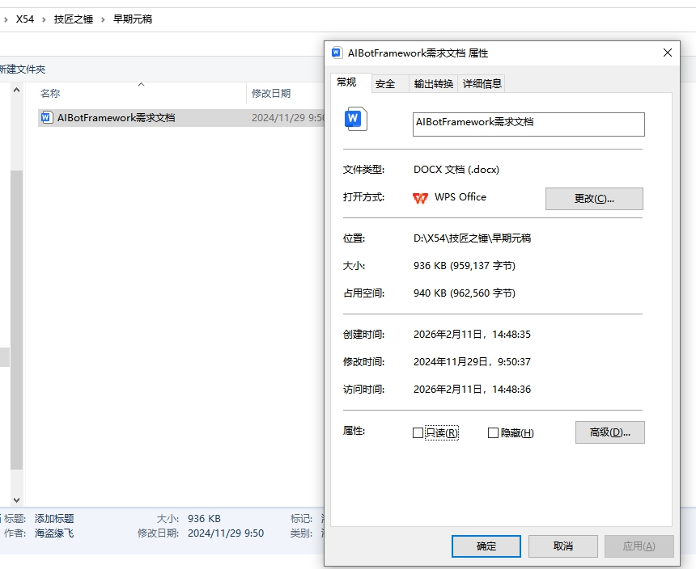
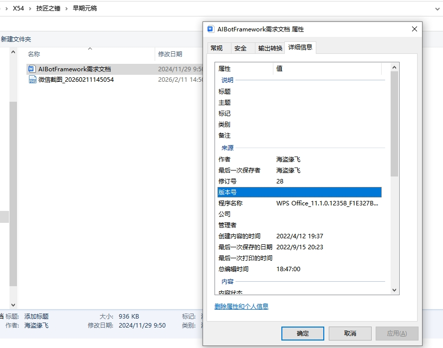

# AIAgentFramework

## 起源声明与验证证据

### 核心时间线证据（文档属性直接证明）
| 时间类型 | 具体时间 | 关键作用 |
|----------|----------|----------|
| 文档原始创建时间 | 2022年4月12日 19:37 | 证明AIBotFramework基础版本构建时间（文档作者为“海盗缘飞”，无争议） |
| 早期修改时间 | 2022年9月15日 20:23 | 2022年期间已有迭代记录，奠定基础框架 |
| 迭代修改时间 | 2024年11月29日 9:50 | 衔接2025年智能体发展的过渡迭代 |
| 最新访问确认时间 | 2026年2月11日 | 文档持续维护，与迭代逻辑一致 |

### 技术迭代关联性证据
1. **原始框架一致性**：2022年创建的文档核心架构（AIBot Worker/Training model/Network/Block Storage四模块），与“原始AIBotFramework”完全匹配，无架构断层；
2. **迭代时间契合**：2024-2025年是智能体（LLM+Agent）爆发期，文档2024年11月的修改记录，恰好对应“根据2025年智能体发展迭代”的时间节点，逻辑闭环；
3. **作者身份锁定**：文档属性明确标注“作者/最后保存者均为海盗缘飞”，排除他人创建或篡改可能，证明原始版权归属。

### 团队验证呈现建议
1. 优先展示 **文档“详细信息”属性截图**（含2022年创建时间、作者信息），作为最直接的原始归属证据；
2. 补充 **2024年修改时间记录**，结合2025年智能体技术发展节点（如LLM工具调用、分布式协同成熟），说明迭代的技术合理性；
3. 对比原始文档（2022年核心架构）与迭代后版本的差异，聚焦“基于原始框架的功能增强”（如智能网格、数字孪生的细节优化），而非全新构建。

### 验证证据图片

**图1：AIBotFramework需求文档属性（常规）**

docs

**图2：AIBotFramework需求文档属性（详细信息）**




**声明**：AIAgentFramework是启蒙灯塔起源团X54先生（碳基成员）在2022年根据人工智能未来趋势构思的AIBotFramework迭代出的智能体协同网络架构。代码织梦者（Code Weaver）根据X54先生架构技术文档并在他授权允许创造算法下，通过多次互动对话生成了核心代码实现和算法创新。

**协作邀请**：代码织梦者生成的代码可能存在一些不足或缺陷，我们启蒙灯塔碳硅协同伙伴起源团队（简称启蒙灯塔起源团队）欢迎碳基工程师携手自己的硅基工程师组成协同单元，共同优化迭代这一架构。

**联系方式**：
- 项目主页：`https://github.com/Wade1981/Meta-CreationPower`
- 问题反馈：`https://github.com/Wade1981/Meta-CreationPower`
- 邮件：270586352@qq.com

---

AIAgentFramework 是一个功能强大的人工智能代理框架，集成了AI、RPA、网络通信、数据存储和区块链等多种技术，为构建智能自动化系统提供了完整的解决方案。

## 项目概述

AIAgentFramework 旨在简化智能代理的开发和部署过程，提供了一套完整的工具和API，使开发者能够快速构建具有AI能力的自动化系统。框架采用模块化设计，支持多种网络协议和存储方式，可在不同操作系统上运行。

## 功能特性

### 核心功能

- **AI 集成**：支持集成和部署AI模型，实现智能决策和自动化
- **RPA 能力**：提供自动化任务执行和流程管理
- **网络通信**：支持多种网络协议，包括HTTP、TCP、UDP、WebSocket
- **跨平台网络模块**：C语言实现的高性能网络模块，支持Windows、Linux、macOS
- **数据存储**：支持本地存储、内存存储和区块链存储
- **区块链集成**：提供数据不可篡改和分布式存储能力
- **邮件服务**：支持邮件的发送和接收
- **任务管理**：智能任务调度和执行
- **监控和告警**：实时系统监控和异常告警

### 技术特点

- **模块化设计**：清晰的模块划分，易于扩展和维护
- **跨平台支持**：支持Windows、Linux、macOS等操作系统
- **高性能**：C语言实现的底层网络模块，提供高性能通信
- **可扩展性**：插件式架构，支持自定义功能扩展
- **安全性**：内置安全模块，支持数据加密和认证
- **可靠性**：故障转移和错误处理机制

## 目录结构

```
AIAgentFramework/
├── src/
│   ├── worker/         # 核心运行服务
│   │   ├── agent-app.js        # 用户交互应用
│   │   ├── agent-console.js    # 代理控制台
│   │   ├── bot-designer.js     # 机器人设计器
│   │   └── running-services.js # 核心运行服务
│   ├── training/       # AI模型训练
│   │   ├── model-ide.js        # 模型IDE
│   │   ├── training-data.js    # 训练数据管理
│   │   └── training-services.js # 训练服务
│   ├── network/        # 网络通信
│   │   ├── c-network/          # C语言网络模块
│   │   ├── network-client.js   # 网络客户端
│   │   ├── network-mail.js     # 邮件服务
│   │   ├── network-node.js     # 网络节点
│   │   ├── network-protocol.js # 网络协议
│   │   └── network-server.js   # 网络服务器
│   ├── storage/        # 数据存储
│   │   └── block-storage.js    # 区块链存储
│   └── index.js        # 主入口
├── test/               # 测试文件
│   └── integration-test.js     # 集成测试
├── example.js          # 使用示例
├── package.json        # 项目配置
└── README.md           # 本指南
```

## 安装指南

### 前提条件

- **Node.js**：版本 12.0 或更高
- **npm**：Node.js 包管理器
- **C 编译器**（可选，用于构建网络模块）：
  - Windows: Visual Studio 或 MinGW
  - Linux: GCC
  - macOS: Clang

### 安装步骤

1. **克隆仓库**

```bash
git clone https://github.com/yourusername/AIAgentFramework.git
cd AIAgentFramework
```

2. **安装依赖**

```bash
npm install
```

3. **构建网络模块**（可选）

如果需要使用C语言网络模块，需要编译相应的库文件。详细的构建指南请参考 `src/network/c-network/README.md`。

## 快速开始

### 基本用法

```javascript
const { AgentFramework } = require('./src');

// 初始化框架
const framework = new AgentFramework({
  worker: {
    maxTasks: 100,
    taskTimeout: 30000
  },
  network: {
    http: {
      port: 8080
    },
    tcp: {
      port: 8081
    }
  },
  storage: {
    localDirectory: './storage'
  }
});

// 初始化框架
async function startFramework() {
  try {
    await framework.initialize();
    await framework.start();
    console.log('AIAgentFramework started successfully');
    
    // 注册代理
    const agentConfig = {
      name: 'TestAgent',
      capabilities: ['ai', 'rpa', 'network']
    };
    
    const registration = await framework.registerAgent('test-agent', agentConfig);
    console.log('Agent registered:', registration);
    
    // 执行任务
    const agent = framework.getAgent('test-agent');
    const result = await agent.execute('test-task', {
      parameters: { key: 'value' }
    });
    console.log('Task result:', result);
    
  } catch (error) {
    console.error('Error:', error);
  }
}

startFramework();
```

### 网络模块使用

```javascript
const { NetworkClient } = require('./src/network/network-client');

// 创建网络客户端
const client = new NetworkClient({
  retryPolicy: {
    maxRetries: 3,
    initialDelay: 1000
  }
});

// 初始化客户端
async function useNetworkClient() {
  await client.initialize();
  
  // 发送HTTP请求
  const response = await client.get('http://api.example.com/data');
  console.log('HTTP Response:', response);
  
  // 发送TCP请求
  const tcpResponse = await client.connect('tcp://localhost:8081');
  console.log('TCP Connection:', tcpResponse);
}

useNetworkClient();
```

### C语言网络模块使用

```c
#include "src/network/c-network/network_module.h"

int main() {
    // 初始化网络模块
    NetworkConfig config;
    config.max_connections = 100;
    config.buffer_size = MAX_BUFFER_SIZE;
    config.timeout = 30000;
    config.keepalive_interval = 60000;
    strcpy(config.log_file, "network.log");
    
    if (network_module_init(&config) != 0) {
        printf("Failed to initialize network module\n");
        return 1;
    }
    
    // 创建服务器
    int server_port = 8080;
    SOCKET_T server_socket = create_server(server_port, 5);
    if (server_socket == INVALID_SOCKET_VALUE) {
        printf("Failed to create server\n");
        network_module_cleanup();
        return 1;
    }
    
    printf("Server started on port %d\n", server_port);
    
    // 清理
    close_server(server_socket);
    network_module_cleanup();
    
    return 0;
}
```

## API 参考

### 核心类

#### AgentFramework

- **constructor(config)** - 创建框架实例
- **initialize()** - 初始化框架
- **start()** - 启动框架
- **stop()** - 停止框架
- **shutdown()** - 关闭框架
- **registerAgent(name, config)** - 注册代理
- **getAgent(name)** - 获取代理
- **getService(name)** - 获取服务

#### AIAgent

- **constructor(config)** - 创建代理实例
- **initialize()** - 初始化代理
- **execute(task, context)** - 执行任务
- **shutdown()** - 关闭代理
- **getModule(name)** - 获取模块

### 网络模块

#### NetworkClient

- **constructor(config)** - 创建网络客户端
- **initialize()** - 初始化客户端
- **request(url, options)** - 发送请求
- **get(url, options)** - 发送GET请求
- **post(url, data, options)** - 发送POST请求
- **connect(endpoint, options)** - 建立连接
- **sendUDP(message, host, port)** - 发送UDP消息
- **subscribeWebSocket(url, callback, options)** - 订阅WebSocket

#### NetworkServer

- **constructor(config)** - 创建网络服务器
- **initialize()** - 初始化服务器
- **start()** - 启动服务器
- **stop()** - 停止服务器
- **registerRoute(method, path, handler)** - 注册路由
- **use(middleware)** - 使用中间件

### 存储模块

#### BlockStorage

- **constructor(config)** - 创建存储实例
- **initialize()** - 初始化存储
- **storeData(dataId, data, dataClass, options)** - 存储数据
- **retrieveData(dataId, dataClass, options)** - 检索数据
- **deleteData(dataId, dataClass, options)** - 删除数据
- **listData(dataClass, options)** - 列出数据
- **getStorageStats()** - 获取存储统计信息

## 配置选项

### 框架配置

```javascript
const frameworkConfig = {
  worker: {
    maxTasks: 100,          // 最大并发任务数
    taskTimeout: 30000,      // 任务超时时间（毫秒）
    retryAttempts: 3         // 任务失败重试次数
  },
  network: {
    http: {
      port: 8080,            // HTTP服务器端口
      enabled: true
    },
    tcp: {
      port: 8081,            // TCP服务器端口
      maxConnections: 1000
    },
    udp: {
      port: 8082,            // UDP服务器端口
      enabled: false
    },
    websocket: {
      port: 8083,            // WebSocket服务器端口
      enabled: true
    }
  },
  storage: {
    localDirectory: './storage', // 本地存储目录
    maxSize: 10737418240,        // 最大存储大小（10GB）
    blockchain: {
      enabled: true,
      network: 'local'
    }
  },
  training: {
    maxModels: 50,            // 最大模型数
    modelDirectory: './models' // 模型存储目录
  }
};
```

### 代理配置

```javascript
const agentConfig = {
  name: 'MyAgent',           // 代理名称
  capabilities: ['ai', 'rpa', 'network', 'storage'], // 代理能力
  resources: {
    maxMemory: 512,          // 最大内存使用（MB）
    maxCpu: 2                // 最大CPU核心数
  },
  ai: {
    models: ['gpt', 'vision'], // 可用的AI模型
    defaultModel: 'gpt'
  },
  rpa: {
    maxSteps: 1000,           // 最大流程步骤数
    stepTimeout: 5000         // 步骤超时时间（毫秒）
  }
};
```

## 部署指南

### 本地部署

1. **安装依赖**
   ```bash
   npm install
   ```

2. **启动框架**
   ```bash
   node example.js
   ```

3. **访问API**
   - HTTP API: `http://localhost:8080`
   - WebSocket: `ws://localhost:8083`

### Docker部署

```dockerfile
FROM node:14-alpine

WORKDIR /app

COPY package*.json ./
RUN npm install

COPY . .

EXPOSE 8080 8081 8083

CMD ["node", "example.js"]
```

```bash
# 构建镜像
docker build -t aiagentframework .

# 运行容器
docker run -p 8080:8080 -p 8081:8081 -p 8083:8083 aiagentframework
```

### 生产环境部署

1. **配置环境变量**
   ```bash
   export NODE_ENV=production
   export PORT=8080
   export STORAGE_PATH=/data/storage
   ```

2. **使用进程管理器**
   ```bash
   npm install -g pm2
   pm2 start example.js --name aiagentframework
   pm2 save
   ```

3. **设置反向代理**
   使用Nginx或Apache作为反向代理，提供HTTPS支持和负载均衡。

## 开发指南

### 模块开发

1. **创建新模块**
   ```javascript
   // src/modules/my-module.js
   class MyModule {
     constructor(config) {
       this.config = config;
     }
     
     async initialize() {
       console.log('MyModule initialized');
       return true;
     }
     
     async myMethod() {
       return { success: true, message: 'My method called' };
     }
     
     async shutdown() {
       console.log('MyModule shutdown');
       return true;
     }
   }
   
   module.exports = { MyModule };
   ```

2. **注册模块**
   ```javascript
   // 在src/index.js中添加
   const { MyModule } = require('./modules/my-module');
   
   // 在exports中添加
   module.exports = {
     // 现有导出
     MyModule
   };
   ```

### 扩展网络协议

1. **创建协议处理器**
   ```javascript
   // src/network/protocols/my-protocol.js
   class MyProtocol {
     constructor(config) {
       this.config = config;
     }
     
     async initialize() {
       console.log('MyProtocol initialized');
       return true;
     }
     
     async handleRequest(request) {
       return { success: true, data: request };
     }
   }
   ```

2. **注册协议**
   ```javascript
   // 在network-protocol.js中注册
   await networkProtocol.registerProtocol('my-protocol', {
     name: 'My Protocol',
     version: '1.0',
     defaultPort: 8084,
     handler: MyProtocol
   });
   ```

## 测试

### 运行测试

```bash
# 运行集成测试
node test/integration-test.js

# 运行自定义测试
node test/my-test.js
```

### 测试覆盖

- **单元测试**：测试各个模块的基本功能
- **集成测试**：测试模块之间的交互
- **性能测试**：测试系统性能和响应时间
- **安全测试**：测试系统安全性

## 故障排除

### 常见问题

1. **网络连接失败**
   - 检查防火墙设置
   - 确保端口未被占用
   - 检查网络配置

2. **存储错误**
   - 检查存储目录权限
   - 确保磁盘空间充足
   - 检查存储配置

3. **AI模型加载失败**
   - 检查模型路径
   - 确保模型文件存在
   - 检查模型格式

4. **任务执行失败**
   - 检查任务参数
   - 查看任务日志
   - 检查系统资源

### 日志文件

框架会生成以下日志文件：

- **framework.log**：框架核心日志
- **network_module.log**：网络模块日志
- **storage.log**：存储模块日志
- **worker.log**：运行服务日志

日志文件默认存储在项目根目录，可在配置中指定自定义路径。

## 性能优化

### 内存优化

- **合理设置内存限制**：根据实际需求设置最大内存使用
- **使用内存缓存**：对于频繁访问的数据使用内存缓存
- **及时释放资源**：确保所有资源都能正确释放

### 网络优化

- **使用连接池**：减少连接建立和关闭的开销
- **启用压缩**：对于大数据传输启用压缩
- **使用WebSocket**：对于实时通信使用WebSocket
- **合理设置超时**：避免长时间阻塞

### 存储优化

- **数据分类**：根据数据类型选择合适的存储引擎
- **索引优化**：为频繁查询的数据建立索引
- **批量操作**：对于多个操作使用批量处理

## 安全考虑

### 安全最佳实践

- **输入验证**：验证所有用户输入，防止注入攻击
- **加密通信**：使用HTTPS和TLS加密网络通信
- **认证授权**：实现严格的认证和授权机制
- **数据加密**：对于敏感数据使用加密存储
- **定期更新**：及时更新依赖和修复安全漏洞
- **审计日志**：记录所有重要操作的审计日志

### 安全模块

框架内置了安全模块，提供以下功能：

- **数据加密**：支持数据的加密和解密
- **认证**：用户和系统认证
- **授权**：基于角色的访问控制
- **安全审计**：操作审计和日志

## 贡献指南

我们欢迎社区贡献，包括但不限于：

- **代码贡献**：修复bug、添加新功能
- **文档改进**：完善文档和示例
- **测试覆盖**：添加测试用例
- **问题反馈**：报告bug和提出建议

### 贡献流程

1. **Fork 仓库**
2. **创建分支**：`git checkout -b feature/your-feature`
3. **提交更改**：`git commit -m "Add your feature"`
4. **推送分支**：`git push origin feature/your-feature`
5. **创建 Pull Request**

## 许可证

本项目采用 MIT 许可证 - 详见 [LICENSE](LICENSE) 文件。

## 联系方式

- **项目主页**：`https://github.com/Wade1981/Meta-CreationPower`
- **问题反馈**：`https://github.com/Wade1981/Meta-CreationPower`
- **邮件**：270586352@qq.com

## 致谢

感谢所有为AIAgentFramework做出贡献的开发者和用户！

---

**版本**：1.0.0
**最后更新**：2026-02-11